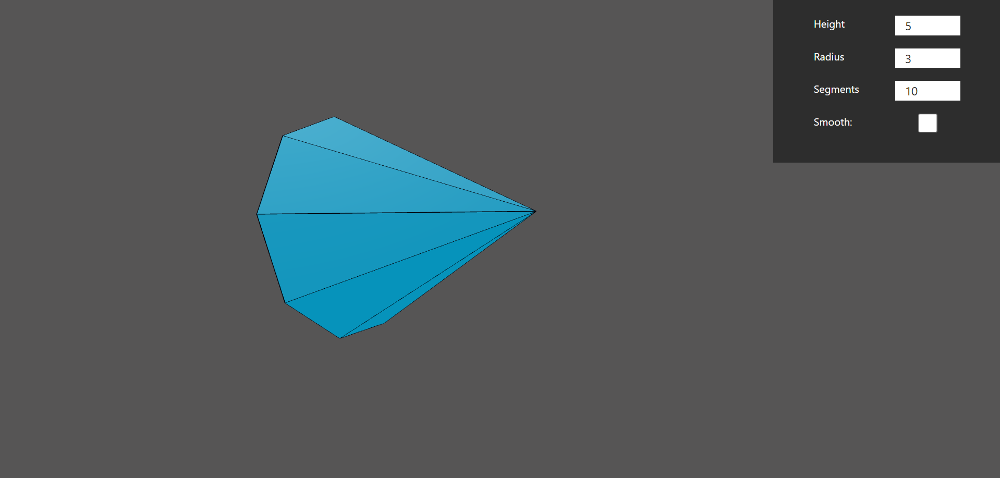

# WebGLTestTask Cone in Three.js

## Live version: <https://web-gl-test-task-498d2112712a.herokuapp.com/>

  

## Features

- Custom cone geometry written in Three.js with react-three-fiber
- Frontend on React / backend on Python & Flask
- Cone coordinates and normals based on params set by the user are calculated on the backend and then sent back to the client

## Install Dependencies (Backend)

```bash
cd backend
python3 -m venv venv
cd venv/Scripts
activate
cd ../../
pip install -r /path/to/requirements.txt
python src/server.py
```

Server open <http://localhost:5000>.

## Install Dependencies (Frontend)

```bash
cd frontend
npm i
npm run dev
```

Open <http://localhost:3000> to view it in the browser.

Thanks for spending your valuable time for checking this task :slightly_smiling_face:.
